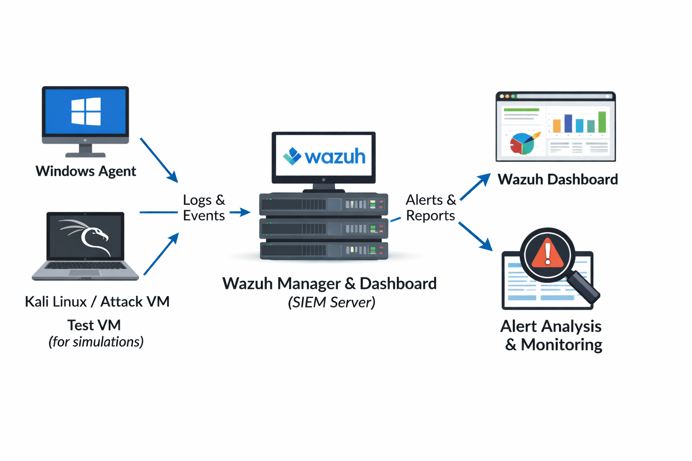
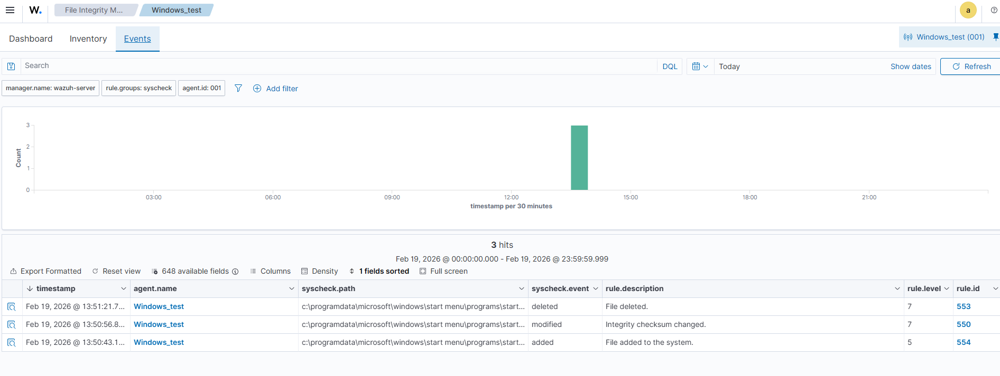
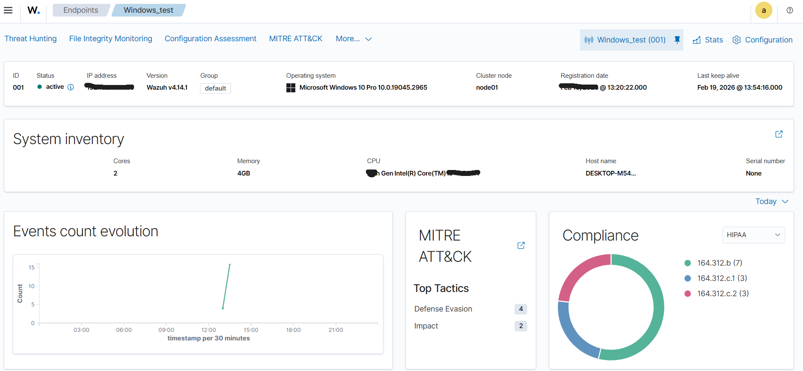
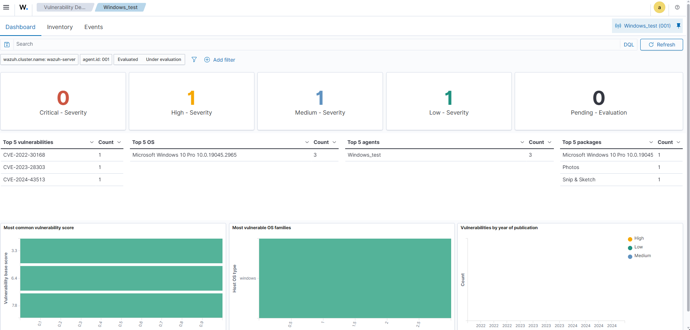

# Wazuh-SOC-Lab
Hands-on SOC lab using Wazuh SIEM: Windows agent monitoring, File Integrity Monitoring (FIM), SCA, Vulnerability Assessment and security event simulations.
# Wazuh SOC Lab

This repository demonstrates a hands-on Security Operations Center (SOC) lab using Wazuh SIEM on Windows agents via VMware.

## Lab Overview
- Wazuh Manager & Dashboard deployed via ISO in VMware
- Windows agent installed and connected
- File Integrity Monitoring (FIM) configured
- Security Configuration Assessment (SCA) enabled (pending Java installation)
- Vulnerability detection module enabled for Windows agents
- Simulated attacks:
  - Brute force login attempts
  - Port scanning
  - File modifications

## Architecture

## File Integrity Monitoring (FIM) Test
- Created, modified, and deleted test files in monitored directories
- Syscheck module generated alerts

## Agent Status
- Windows agent connected and active

## Vulnerabilities Module
- Vulnerabilities detected in Windows agents

## Key Learnings
- Hands-on SOC alert triaging and monitoring
- Centralized log collection from Windows agents
- MITRE ATT&CK mapping for detected threats
- Security Configuration Assessment (CIS benchmarks)
